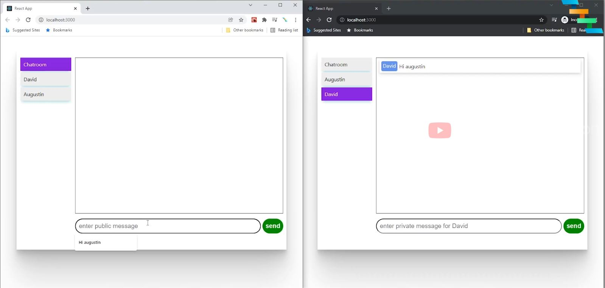

# ChatApplication

Spring boot websocket backend and reactjs client

Mô tả tính năng:

- User vào trang web, nhập username -> bấm nút connect
- Dưới backend add user vào DB, trang web cập nhật giao diện

Server: - Spring boot Websocket

Client - ReactJS

## ReactJS screen

To start:

### Client

        - npm install (in the react-client folder)
        - npm run dev

### Server

        - start server lên
        - mvn spring-boot:run (in the spring-ws-server)
